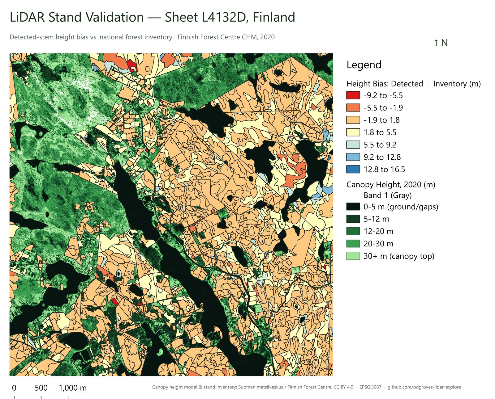
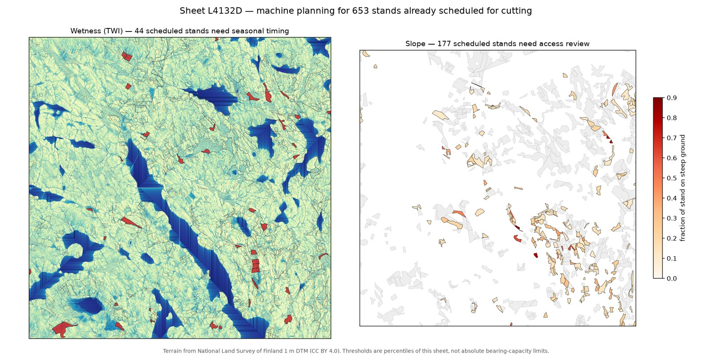
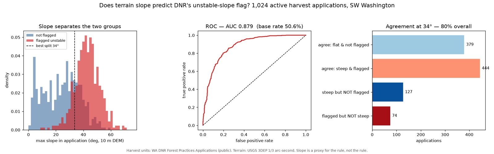

# lidar-explore

**Some people chase storms. I chase trees — through a hundred million points
of laser noise, into a national forest inventory, and out the other side with
numbers that survived contact with reality.**

This project starts in a calm, controlled sandbox — a synthetic Finnish forest
where every tree's exact location is already known — then drives straight into
the real thing: raw airborne LiDAR over a live 6x6 km slice of Finland,
validated stand-by-stand against 1,295 real records from the Finnish Forest
Centre's national inventory. No held-out demo set. National data, real stands,
real foresters' own harvest calls used as the benchmark.

The workflow mirrors what commercial forestry operators build at scale: raw
point cloud -> ground/canopy separation -> individual-tree detection ->
structured features in a warehouse -> stand-level management decisions.


*Every stand on Sheet L4132D, colored by how far the LiDAR-detected height
missed the ground-truth inventory. Warm means the estimator ran hot, cool
means it ran cold — the map does not editorialize, and neither does the
report below.*

---

## Four things this chase found — each one busting something the last step seemed to prove

Storm chasers keep the instruments running through the wrong turns, because
the wrong turns are half the data. Same rule here: every result below
corrected something the previous one made look settled.

**1. The scoreboard lied. Recall is gameable; height error is not.**
78.4% recall, 98.6% precision on the synthetic sample — but that stand is
~28 stems/ha, so crowns barely overlap. Thinning the cloud to 0.5 p/m2
*raised* recall to 81.8% while precision fell to 92.0% and height RMSE
quadrupled from 0.44 m to 1.63 m. A sparse CHM has more empty cells than
filled ones; nodata-as-zero creates spurious local maxima, some of which land
near real trees. Height RMSE is the honest density metric — recall just
looked honest.

**2. Resolution beat point count, every time.**
A 2 m CHM scored worse than 1 m at every density tested, and birch — wide,
flat crowns — degraded worst. Resolution was the binding constraint, not
point count.

**3. Cross-epoch bias hides exactly where ground calibration can't see it.**
On real Forest Centre CHMs for 2008/2015/2020, the bare-ground median offset
was +0.00 m for every epoch pair — perfect ground agreement, and it told us
nothing about canopy. Binning change on an *independent* third epoch (to kill
regression-to-the-mean) showed 2008-2020 gains nearly flat across every
height band, +0.25 to +0.32 m/yr including 28 m+ stands that should be
near-asymptotic. A constant gain regardless of tree size is an additive
offset, not biology: the 2008 flight under-measured canopy while measuring
ground correctly. Relative ranking survives an additive bias; absolute
current-annual-increment does not.

**4. Detection nails height, whiffs on stem count — and the harvest crews
already knew.**

| | value |
|---|---|
| stem recovery, median | **16.3%** of inventory stems/ha |
| by class: 02 young / 03 advanced / 04 mature | 12% / 15% / **17%** |
| detected-stem height vs inventory mean | **+1.19 m**, r = **0.962** |
| whole-pixel CHM height vs inventory mean | -3.95 m, r = 0.901 |

All on the same 1,295 stands: private forest, usable development class, and
inventory observed within 6 years of the CHM epoch. Recovery rises
monotonically with maturity — fewer, larger, better-separated crowns are
easier to resolve — and the estimator matters: mean over *detected stems*
brackets inventory mean from above (crown apexes), while mean over *all
pixels* sits below it because it averages in canopy gaps. Same raster,
opposite sign; the stem-based estimator correlates better.

**Plus one clean negative result, reported because it's true, not because it
flatters the method.** Harvest ranking was benchmarked against 5,059 real
cutting proposals. Once stands are filtered to development class 04
(regeneration-mature), 471 of 472 eligible stands were already proposed for
cutting — base rate 100%, lift 1.00x. The forester's own maturity call
determines the list; the CHM adds no discriminating power on top of it.

---

## Pipeline

```
SYNTHETIC TRACK (ground truth known)
  nuuksio_sample.laz
        |- inspect_laz.py        density, extent, classification
        |- nuuksio_workflow.py   PDAL: ground -> DEM, hag_nn -> CHM
        |- detect_trees.py       local-max detection, scored vs truth
        |- density_study.py      thin the cloud, measure error vs density
        \- load_to_snowflake.py  GEOGRAPHY table + spatial SQL

REAL TRACK (Finnish Forest Centre open data)
  fetch_metsakeskus.py     index-driven CHM tile download + crop
  chm_change.py            multi-epoch change, bias diagnostics
  stand_validate.py        detection vs inventory, targeting vs plan
  harvest_targeting.py     stand ranking with retention-tree selection
  make_maps.py             publication figures
```

---

## Setup

```powershell
git clone git@github.com:bdgroves/lidar-explore.git
cd lidar-explore
pixi install
pixi shell
```

Requires [pixi](https://pixi.sh) — handles PDAL, GDAL, PROJ, geopandas and
rasterio cleanly on Windows. Optional: QGIS for browsing rasters and building
figures like the one above, Snowflake for the warehouse step.

---

## Synthetic track

```powershell
python inspect_laz.py       # 1,034,754 pts over 405 x 403 m = 6.34 p/m2
python nuuksio_workflow.py  # DEM + CHM + overview
python detect_trees.py      # scored against 450 known trees
python density_study.py     # error vs point density
```

```
Ground truth 450   detected 358   TP 353   FP 5   FN 97
Recall 78.4%   Precision 98.6%   F1 87.4%   height RMSE 0.44m
spruce 88.2%   pine 73.1%   birch 68.3%
```

Density study, 1 m CHM:

```
 p/m2   detected  recall  precision  height RMSE
 0.49       400    81.8%     92.0%       1.63m
 1.05       366    78.9%     97.0%       1.14m
 2.10       361    79.1%     98.6%       0.76m
 3.16       362    78.2%     97.2%       0.60m
 6.31       358    78.4%     98.6%       0.44m
```

Read the RMSE column, not recall. See finding 1.

**Caveat carried throughout:** the synthetic stand is ~28 stems/ha. Real
managed Finnish forest on sheet L4132D measures ~496 stems/ha median and
~444 in mature class-04 stands. An earlier draft cited 800-1,500 — that
range applies to young unthinned stands, not forest at rotation age.

---

## Real data: Finnish Forest Centre

Two open datasets, CC BY 4.0, no registration, no API key.

**Latvusmalli** — 1 m canopy height model, 6 km x 6 km tiles, EPSG:3067,
derived from the licensed 5 p laser data. `fetch_metsakeskus.py` reads the
published GeoPackage index (download URL + precomputed stats per tile).

```powershell
python fetch_metsakeskus.py --sheet L4132D --year all --list
python fetch_metsakeskus.py --sheet L4132D --year 2020 --crop 364000 6685000 365000 6686000
```

**Metsavarakuviot** — stand polygons with inventory, proposed operations and
restrictions. Relational GeoPackage, ten tables.

Note: **MML "Laser scanning data 5 p" is not free** — it needs payment and
Finnish strong authentication, not practically available to non-residents.
The free 0.5 p product is 13x sparser than this project's synthetic sample.
The Forest Centre CHM is the better free route, being derived from the
licensed data.

### Schema gotchas that silently corrupt results

* `treestand.type`: **1 = observed, 2 = projected to 2026, 3 = projected to
  2036.** Joining a projection compares your raster to a simulation.
* `treestandsummary` exists **only for types 2 and 3**. Observed inventory is
  in `treestratum`, per species, and `stemcount` there is null — derive
  density as `N = G / (pi/4 * d^2)` from basal area and mean diameter.
* Observation dates span **1999-2024**. A 2020 raster against a 1999
  measurement reads as detection error when it is two decades of growth.
  `stand_validate.py` filters to +/-6 years (219 of 1,779 stands excluded).
* Attributes for classes **A0 and T1 are documented as unusable** by the
  producer. Dropped, not silently compared.
* Metsavarakuviot covers **private** forest only — 2,165 ha of the 3,600 ha
  sheet. State land including Nuuksio National Park is absent, so absence is
  treated as a **whitelist block**. A blacklist would fail open on any gap.

### Development classes (kehitysluokka)

| code | Finnish | English |
|---|---|---|
| A0 | aukea | open / clearcut |
| T1 | pieni taimikko | seedlings <=1.3 m |
| T2 | varttunut taimikko | advanced seedlings >1.3 m |
| Y1 | ylispuustoinen taimikko | seedlings under overstory |
| 02 | nuori kasvatusmetsikko | young thinning stand |
| 03 | varttunut kasvatusmetsikko | advanced thinning stand |
| 04 | uudistuskypsa metsikko | **regeneration-mature** |

Class 04 replaced an earlier Chapman-Richards age model. A forester's own
maturity judgement beats inverting a growth curve with an assumed site index
(which also clamped at age 181 for any stand taller than the assumed H100).

---

## Change detection

```powershell
python chm_change.py --all-pairs --by-height --no-viz
python chm_change.py --a 2008 --b 2020 --bin-on 2015 --by-height
```

Two diagnostics matter more than the change map itself:

**Ground offset** — median difference over pixels bare in the earlier epoch.
Non-zero means systematic processing bias. All three pairs returned +0.00 m,
and told us nothing about canopy.

**Height-stratified increment** — real height growth declines steeply with
tree size. Gains flat across bands, or rising with height, indicate bias not
biology. Use `--bin-on` with a third epoch to define bins; otherwise
regression to the mean drags the top bands down and can invert the
conclusion. It did, in an earlier run: the pair that looked textbook-clean
was the biased one.

---

## Stand validation

```powershell
python stand_validate.py --year 2020 --top 15
```

Joins detection to stand polygons, compares against observed inventory,
scores ranking against the management plan. Writes
`data/stand_validation.csv`. The map at the top of this README is the visual
version of that file — every stand's detected-vs-inventory height bias,
mapped across the real tile.

---

## API

The validated stand data is also queryable live, not just through scripts:

```powershell
pixi run uvicorn api:app --reload
```

Then hit `http://127.0.0.1:8000/docs` for interactive Swagger docs, or:

```
GET /stands?developmentclass=04&limit=10   # filter stands by class, area, eligibility
GET /stands/{standid}                       # single stand, full detection + inventory record
GET /summary                                # live-computed validation stats for the current data
```

Built on FastAPI over the same `data/stand_validation.csv` that
`stand_validate.py` produces — no separate demo dataset, no mock data. The
`/summary` endpoint is explicit about which population it's scoring against,
since it's a live query rather than the hand-curated 1,295-stand set
documented above.

---

## Where do the machines go? Terrain planning for the stands already chosen

The harvest-ranking result above is a clean negative: filtered to development
class 04, the CHM adds no discriminating power over the forester's own
maturity call. **Which** stand to cut is already decided.

Terrain answers a question the plan does not. In Nordic forestry the dominant
environmental problem is not stand selection, it is **rutting** -- a loaded
forwarder churning saturated soil, shearing roots and delivering sediment to
watercourses. The standard mitigation is timing: wet ground is cut frozen.

That needs a terrain model, which the CHM is not -- canopy height is height
*above* ground, so it carries no elevation. Finland's National Land Survey
publishes a 1 m DTM for the whole country, and CSC mirrors it as an open VRT
with no API key:

```
https://vm0160.kaj.pouta.csc.fi/mml/korkeusmalli/km2/2020/km2_2020.vrt
```

The VRT points at 60 tiles of 100 km each over plain HTTP. Reading the one
tile covering L4132D and windowing to the sheet takes 18 seconds and no full
download.



From that DTM, two measures per stand:

* **slope** -- an access problem. Steep ground limits machines and raises
  erosion risk.
* **TWI**, `ln(a / tan b)` -- a scheduling problem. High values mark where
  water collects.

Of **653 stands in class 04 with a cutting proposal**:

| Season (wetness) | n | | Access (slope) | n |
|---|---:|---|---|---:|
| summer-trafficable | 609 | | conventional | 476 |
| dry season preferred | 43 | | winch assist advised | 145 |
| frozen-ground only | 1 | | steep - review access | 32 |

**Only 3 stands are both wet and steep.** The two constraints land on almost
entirely different stands, so they decompose into separate planning problems
rather than one blended risk score.

### Two things this got wrong first

**Merging the constraints.** The first version summed wet and steep into one
"sensitivity" number and derived a single season label from it. Stands that
were 89% steep came out labelled `summer-trafficable`, because the season rule
only ever looked at wetness. Wet and steep have different mitigations --
schedule versus winch -- so they are now separate flags. A blended score
would have hidden exactly the stands that need attention.

**Counting nulls as findings.** The map first reported 45 wet and 178 steep
against the script's 44 and 177. Stands too small to sample (<5 cells) carry a
null label, and `!= "summer-trafficable"` is true for nulls. Two phantom
stands, from a comparison that treated missing as flagged.

### What this is not

The thresholds are **percentiles of this sheet**, not absolute limits.
Real bearing capacity depends on soil texture, machine weight, tyre and track
configuration and season -- none of which are in this data. The output ranks
these stands against each other; it is not a trafficability model, and the
class boundaries would need calibration against observed rutting before
anyone drove on them.

One structural caveat: TWI carries `tan(slope)` in its denominator, so wet and
steep are anti-correlated partly **by construction**. The near-total
separation between the two groups is therefore not an independent discovery,
though it is also consistent with the obvious hydrology -- water does not pool
on a 30-degree rock face.

```powershell
python machine_planning.py            # DTM -> slope + TWI -> per-stand stats
python machine_planning_fig.py        # the figure above
```

---

## Washington: testing terrain against a real regulator's decision

The machine-planning thresholds above are percentiles I chose. Nothing
external says a stand at the 85th percentile of wetness is actually a problem.
That is the weakest part of that analysis.

Washington supplies the missing standard. DNR publishes every **Forest
Practices Application** as an open polygon layer, and each carries
`UNSTABLE_SLOPE_FLG` — the agency's own determination, made by their staff
under the Forest Practices rules, of whether the proposal involves potentially
unstable slopes. That is a real label. So: **does terrain-derived slope
predict it?**

Study area is Pacific Cascade region, SW Washington, deliberately spanning the
steep Willapa Hills and the flat Cowlitz floodplain. The label there is almost
exactly balanced, so the baseline to beat is a coin flip.



**1,024 applications, base rate 50.6% flagged:**

| Metric | Not flagged | Flagged | AUC |
|---|---:|---:|---:|
| mean slope | 8.1° | 16.5° | 0.860 |
| 90th-pct slope | 15.3° | 27.9° | 0.857 |
| **max slope** | **24.9°** | **42.6°** | **0.879** |

A single threshold at 33.7° max slope classifies **80.4%** of applications
correctly against a 50.6% base rate. Unlike the Finnish harvest-ranking null,
terrain here carries real signal.

### The unit of analysis was wrong first

The first run scored 1,533 individual harvest units and got AUC 0.854. But
the flag never varies between units sharing an `FP_ID` — zero applications out
of 1,024. `UNSTABLE_SLOPE_FLG` is an **application** attribute, so unit-level
scoring is pseudo-replication: 1,533 rows are only 1,024 independent
decisions, and an application subdivided into 17 units would carry 17 times
the weight of one drawn as a single polygon.

Aggregating to the application — the actual unit of decision — the result is
both smaller and stronger: n=1,024, AUC 0.879. The script now reports both so
the difference is visible rather than buried.

### Why a high AUC here is not a discovery

The rules define unstable landforms **partly by gradient**. Recovering the
flag from slope is therefore closer to reproducing a known determination from
one of its own inputs than to finding something new. The honest claim is that
the pipeline reproduces an operational decision it was never shown — useful as
validation, not as insight.

The residual is the interesting part. At the best threshold, **127
applications are steep but not flagged** and **74 are flagged but not steep**.
Those are where gradient alone diverges from the rule, which also names
specific landforms — inner gorges, convergent headwalls, bedrock hollows —
that a 10 m DEM cannot resolve and a gradient threshold cannot express. A
1 m lidar DTM and curvature-based landform detection is the obvious next step,
and the flagged-but-flat group is the set to check it against.

```powershell
python wa_fpa.py --fetch     # DNR polygons + 3DEP DEM windows
python wa_fpa.py             # unit-level vs application-level test
python wa_fpa_fig.py         # figure + disagreement cases
```

---

## Snowflake

`load_to_snowflake.py` reprojects EPSG:3067 -> 4326, stages via
`write_pandas`, builds a `TO_GEOGRAPHY` table, runs spatial SQL.

Both coordinate systems are kept deliberately: `GEOGRAPHY` for true-metre
`ST_DWITHIN`, projected TM35FIN for equal-area grid binning. At 60 degrees N
a degree of longitude is about half a degree of latitude on the ground, so
lat/lon cells would be badly non-square.

Key-pair auth preferred, credentials from environment only. `write_pandas`
needs **pyarrow** and `quote_identifiers=False` — the default quotes
identifiers, creating case-sensitive columns that make every later `SELECT`
fail mysteriously.

`lidar_dbt/` takes the loaded stand data further — dbt models and singular
tests that encode this project's hard-won corrections (mismatched
populations, crossed columns, silent population drift) as checks that fail
the build instead of failing quietly. See `lidar_dbt/README.md`.

---

## Project structure

```
lidar-explore/
+-- api.py                     FastAPI service over the validated stand data
+-- data/                      generated + downloaded (gitignored)
+-- data/web/                  compressed figures for this README
+-- lidar_dbt/                 dbt models over the validated stand data
+-- generate_nuuksio.py        synthetic sample generator
+-- inspect_laz.py             point cloud summary
+-- nuuksio_workflow.py        DEM + CHM
+-- detect_trees.py            local-max detection + evaluation
+-- density_study.py           error vs point density
+-- load_to_snowflake.py       GEOGRAPHY load + spatial SQL
+-- fetch_metsakeskus.py       real CHM tile fetch + crop
+-- chm_change.py              multi-epoch change + bias diagnostics
+-- stand_validate.py          detection vs inventory, plan benchmark
+-- harvest_targeting.py       stand ranking + retention trees
+-- wa_fpa.py                  WA harvest applications vs terrain slope
+-- wa_fpa_fig.py              WA FPA figure + disagreement cases
+-- machine_planning.py        slope + TWI per stand, harvest scheduling
+-- machine_planning_fig.py    machine-planning figure
+-- make_maps.py               publication figures
+-- REPORT.md                  full write-up
+-- CLAUDE_CONTEXT.md          pickup prompts
```

---

## Notes / gotchas

* Never name a Python file after a stdlib module — hence `inspect_laz.py`.
* `filters.hag_nn` needs classified ground; add `filters.smrf` first if
  absent.
* `maximum_filter` defaults to reflect mode at borders and can create
  spurious edge peaks. Test by shifting the AOI: if clusters follow the edge
  it's an artifact, if they stay put it's geography.
* Binning change on the same epoch you are differencing induces regression
  to the mean. Bin on an independent epoch when one exists.
* One-sided sanity checks miss half the failure modes. A growth check
  bounded only above passed -0.10 m/yr in mature forest without comment.
* Sorted lists always look alarming at the top. An earlier concern about
  639 m3/ha volumes dissolved on seeing the median (206) and 95th pct (406).
* A stand can show near-zero detected stems for a reason that has nothing to
  do with the algorithm: it straddles the CHM tile boundary. `coverage_pct`
  (added to `stand_validate.py` and exposed via the API) catches this --
  110 of 1,840 stands have under 50% CHM coverage. One, stand 38780079,
  inventory says 462 stems/ha and 99% canopy cover, detector found 2 trees --
  because only 3.7% of that stand actually has CHM data. Check coverage
  before trusting a low-recovery outlier.

---

## Why this exists

I grew up reading ridgelines before I read screens. This project is the same
instinct pointed at a data pipeline instead of a trailhead: don't trust the
first number, chase it through a second dataset, and report what's actually
there even when it's a clean negative result. It's the same discipline
that goes into any production geospatial data pipeline — the chase just
happens to be more fun when the terrain is real.

---

## Attribution

Canopy height models and forest resource data:
**Suomen metsakeskus / Finnish Forest Centre**, CC BY 4.0.
